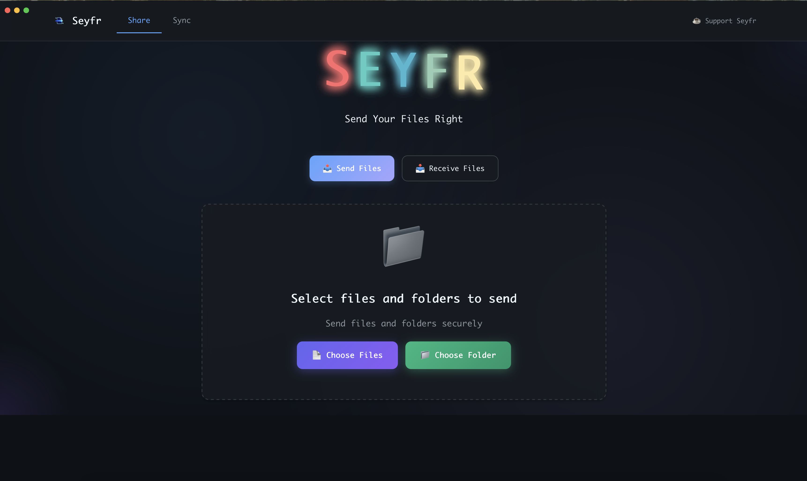

# Seyfr
### Send Your Files Right

**Secure, peer-to-peer file sharing with end-to-end encryption**

## What is Seyfr?

Seyfr enables **direct peer-to-peer file transfers** with end-to-end encryption. Files go directly from your device to the recipient's device.

### **End-to-End Encrypted**
Your files are encrypted before leaving your device. Not even we can see what you're sharing.

### **Direct P2P Transfer**
No intermediary servers. Files transfer directly between devices for maximum speed and privacy.

### **No Size Limits**
Share files of any size - from documents to entire video projects.

### **Cross-Platform**
Available for macOS (Apple Silicon & Intel), Windows, and Linux.

## Download

| Platform | Download | Size |
|----------|----------|------|
| **macOS Apple Silicon** | [Download DMG](https://github.com/Jitpomi/seyfr-releases/releases/latest/download/Seyfr_aarch64.dmg) | 36.2 MB |
| **macOS Intel** | [Download DMG](https://github.com/Jitpomi/seyfr-releases/releases/latest/download/Seyfr_x64.dmg) | 36.2 MB |
| **Windows 64-bit** | [Download EXE](https://github.com/Jitpomi/seyfr-releases/releases/latest/download/seyfr-x64.exe) | 68.1 MB |
| **Windows 32-bit** | [Download EXE](https://github.com/Jitpomi/seyfr-releases/releases/latest/download/seyfr-x86.exe) | 68.1 MB |
| **WebView2 Runtime** | [Download EXE](https://github.com/Jitpomi/seyfr-releases/releases/latest/download/MicrosoftEdgeWebview2Setup.exe) | 2 MB |
| **Linux** | [Download AppImage](https://github.com/Jitpomi/seyfr-releases/releases/latest/download/Seyfr_amd64.AppImage) | 255 MB |

[**View All Releases**](https://github.com/Jitpomi/seyfr-releases/releases) • [**Web Download Page**](https://seyfr.jitpomi.com)

## Quick Start

### Windows Installation
1. **Download** the appropriate Windows version (64-bit or 32-bit)
2. **Download** and run `MicrosoftEdgeWebview2Setup.exe` (required for Windows)
3. **Run** `seyfr-x64.exe` or `seyfr-x86.exe`

### macOS/Linux Installation
1. **Download** Seyfr for your platform
2. **Install** and launch the application

### Using Seyfr
3. **Choose** to send or receive files
4. **Select** your files or folders
5. **Share** the secure connection code with your recipient

That's it! No accounts, no cloud storage, no complexity.

## Built With

- **Rust** - For performance and security
- **Dioxus** - Modern UI framework
- **Iroh** - Peer-to-peer networking
- **End-to-end encryption** - Your privacy is guaranteed

## Support Development

Seyfr is developed by **JITPOMI**, a small team of two developers passionate about building privacy-first tools.

**Your sponsorship helps us:**
- Add new features (mobile apps, sync folders, etc.)
- Improve documentation and user guides
- Fix bugs and enhance performance
- Support the global privacy community

Every contribution — big or small — helps keep privacy-first tools accessible to everyone.

## Project Status

- **Active development** - Regular updates and new features
- **Privacy-first** - No data collection, no tracking
- **Community** - Users worldwide use Seyfr

## Support & Community

- **Report Issues** - [Open an issue](https://github.com/Jitpomi/seyfr-releases/issues)
- **Discussions** - [Join the conversation](https://github.com/Jitpomi/seyfr-releases/discussions)
- **Contact** - [dev@jitpomi.com](mailto:dev@jitpomi.com)
- **X (Twitter)** - [@ssali_samson](https://x.com/ssali_samson)

## License

Seyfr is free software. The application binaries are freely available for download and use, but the source code is not publicly available.

---

[Website](https://seyfr.jitpomi.com) • [Sponsor](https://github.com/sponsors/Jitpomi?o=sd&sc=t) • [Download](https://github.com/Jitpomi/seyfr-releases/releases)

